## Objetivo

Diseñar e implementar un flujo de trabajo DevOps escalable y automatizado en Amazon Web Services (AWS), integrando herramientas de control de versiones, contenedores, infraestructura como código, pipelines de CI/CD, monitoreo y seguridad, con el fin de optimizar los tiempos de entrega, mejorar la estabilidad de las aplicaciones y garantizar la seguridad de la infraestructura en la nube.

## Instrucciones

Caso de análisis:  

La empresa Soluciones Tecnológicas del Futuro es una organización de reciente creación y en expansión, dedicada al desarrollo de aplicaciones web para el sector financiero. Actualmente, enfrenta desafíos en la gestión y despliegue de sus soluciones en la nube. Su proceso de entrega de software es manual, lo que genera retrasos en las actualizaciones, errores durante la implementación en producción y dificultades para monitorear el rendimiento de sus aplicaciones.  

Para abordar estos problemas, Soluciones Tecnológicas del Futuro ha decidido implementar una plataforma automatizada de despliegue y monitoreo en AWS, adoptando prácticas de DevOps. El objetivo de este proyecto es optimizar los tiempos de entrega, mejorar la estabilidad de sus aplicaciones y garantizar la seguridad de la infraestructura en la nube para sus clientes.

## Procedimiento:  

### 1. Elaborar una presentación que exponga los principios de DevOps
   - nombre de la presentación: devops_principios.html

### 2. Crear un repositorio en Github
   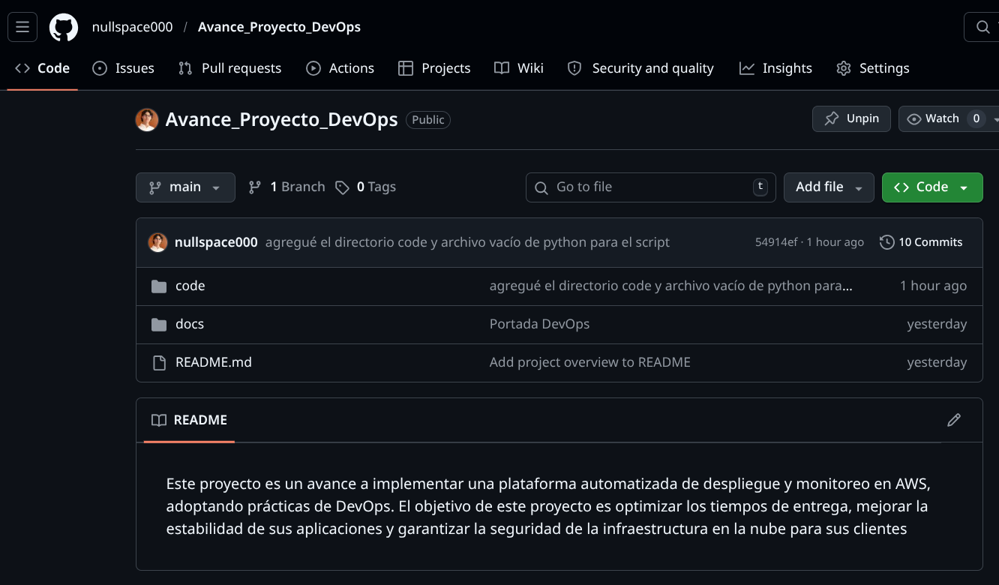

### 3. Configurar un entorno de desarrollo en Linux
   1. Instalar Ubuntu en una máquina virtual local o en una instancia AWS EC2 (solo tamaños nano, micro, small, medium o large).
   2. Configurar paquetes esenciales: git, vim, docker, python3.
   3. Crear y ejecutar scripts Bash para automatizar tareas. 
   ``` sudo apt update && sudo apt upgrade -y
# Herramientas base
sudo apt install -y git vim curl build-essential
# Python 3 y pip
sudo apt install -y python3 python3-pip python3-venv
# Docker Engine (repositorio oficial)
sudo apt install -y ca-certificates gnupg
sudo install -m 0755 -d /etc/apt/keyrings
curl -fsSL https://download.docker.com/linux/ubuntu/gpg | \
sudo gpg --dearmor -o /etc/apt/keyrings/docker.gpg
echo \
"deb [arch=$(dpkg --print-architecture) signed-by=/etc/apt/keyrings/docker.gpg] \
https://download.docker.com/linux/ubuntu \
$(lsb_release -cs) stable" | \
sudo tee /etc/apt/sources.list.d/docker.list > /dev/null
sudo apt update
sudo apt install -y docker-ce docker-ce-cli containerd.io
# Añadir tu usuario al grupo docker
sudo usermod -aG docker "$USER"
```
   5. Automatizar la instalación de dependencias.
   Crea un archivo bootstrap_dev.sh:
   ```#!/usr/bin/env bash
   set -euo pipefail
   sudo apt update
   sudo apt install -y git vim python3 python3-pip docker.io
   echo "Instalación completa. 
   ```
   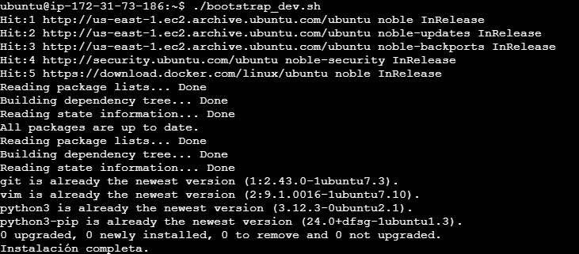
   1. Programar tareas con cron para limpieza de logs.  
      Crea un script clean_logs.shque elimine o rote logs antiguos
      ``` #!/usr/bin/env bash
      set -euo pipefail
      LOG_DIR="/var/log/myapp"
      DAYS_TO_KEEP=7
      find "$LOG_DIR" -type f -name "*.log" -mtime +"$DAYS_TO_KEEP" -print -delete
      ```
   Programa una tarea cron para ejecutarlo, por ejemplo diariamente a las 03:30:
      ```crontab -e
      30 3 * * * /usr/local/bin/clean_logs.sh >> /var/log/clean_logs.cron.log 2>&1
      ```
      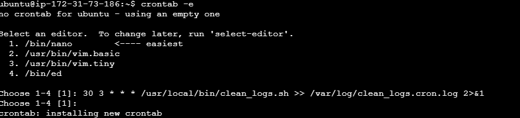


### 4. Desarrollar un script en Python para automatizar tareas
   1. Crear las claves de acceso IAM para poder hacer uso de los script
   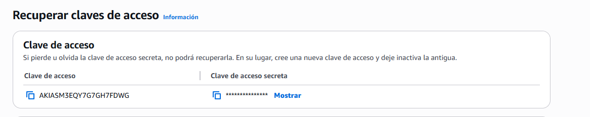
   Configurar los datos en el EC2  
   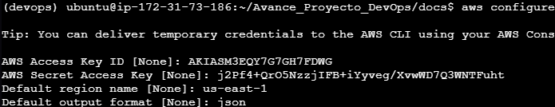
   3. Crear un script para aprovisionar instancias EC2 (máximo 9 instancias en total, respetando los límites de Learner Lab).
   saber el AMI del EC2 para poder hacer la creacion  
   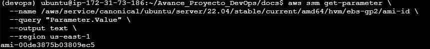  
   Correrlo  
     
   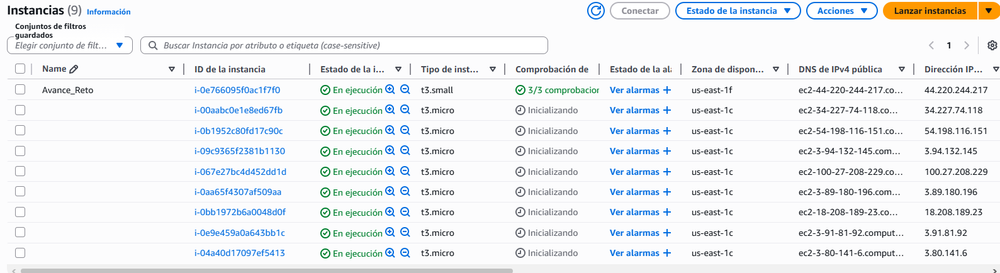
   4. Generar un reporte automático de uso de recursos.  
   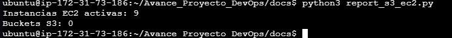
   5. Utilizar Boto3 para interactuar con AWS.
   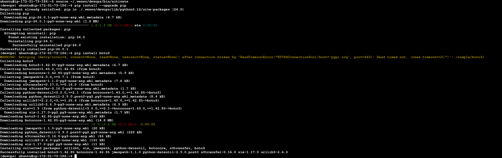
   6. Listar buckets en S3 y sus objetos.  
   

### 5. Diseñar una plantilla CloudFormation
   1. Definir infraestructura en YAML para instancias EC2 y S3, asegurando que las instancias cumplan los límites del entorno.  
   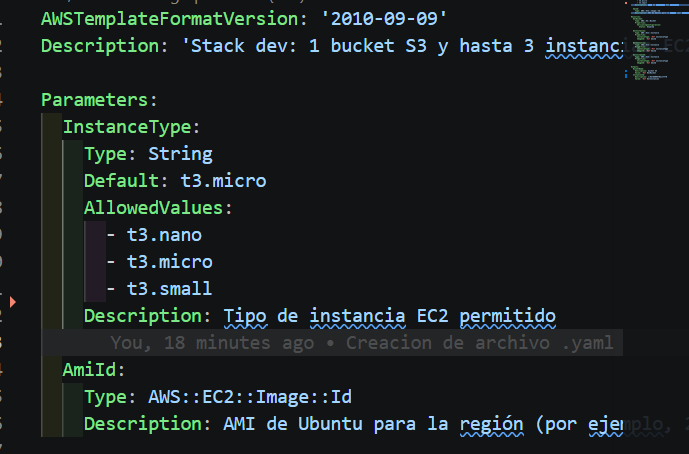
   2. Aplicar políticas de IAM solo con el rol LabRole preexistente, ya que Learner Lab no permite crear nuevos roles o grupos.
   #### No aplica ya que no es learner lab 
   3. Implementar recursos en AWS mediante IaC.
   ```
   aws cloudformation deploy \
  --stack-name devops-stack \
  --template-file stack-dev.yaml \
  --parameter-overrides \
    AmiId=ami-00de3875b03809ec5 \
    InstanceType=t3.micro \
  --region us-east-1
   ```
   4. Desplegar y actualizar infraestructura con AWS CloudFormation deploy.  
   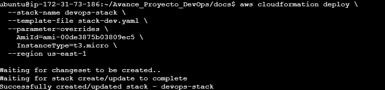  

### 6. Crear una imagen Docker para una aplicación web
   1. Definir un Dockerfile con configuración de nginx o flask.  
   
      Dockerfile: 
      ```
      # Stage 1: Build (dependency instalation)
      FROM python:3.11-slim AS builder

      WORKDIR /app
      COPY requirements.txt .
      # Instalamos dependencias en un directorio local
      RUN pip install --user --no-cache-dir -r requirements.txt

      # Stage 2: Final (light image for exec)
      FROM python:3.11-slim

      WORKDIR /app
      # Copiamos solo las dependencias instaladas y el código
      COPY --from=builder /root/.local /root/.local
      COPY . .

      # Asegurar que el PATH incluya las librerías instaladas
      ENV PATH=/root/.local/bin:$PATH

      EXPOSE 5000
      CMD ["python", "app.py"]
      ```

   2. Optimizar la imagen con multi-stage builds.
      - Tenemos stage 1 y 2  

   3. Configurar docker-compose.yml para múltiples servicios.  
      docker-compose.yml:
      ```
      version: '3.8'

      services:
      web:
         build: .
         ports:
            - "8080:5000"
         volumes:
            - ./app:/app  # Hot-reloading para desarrollo
         networks:
            - frontend
            - backend
         depends_on:
            - db
         environment:
            - REDIS_HOST=db

      db:
         image: redis:alpine
         networks:
            - backend
         volumes:
            - redis_data:/data

      networks:
      frontend:
         driver: bridge
      backend:
         internal: true  # Red aislada para seguridad

      volumes:
      redis_data:
      ```
   4. Definir volúmenes y redes personalizadas.

### 7. Implementar un pipeline CI/CD con AWS CodeCommit
   1. Configurar CodeCommit y CodeBuild para pruebas automatizadas.
   2. Integrar CodePipeline para despliegue continuo.
   3. Enviar archivos a EC2 utilizando AWS Systems Manager Session Manager.
   4. Usar AWS Lambda para automatizar rollback ante fallos.
